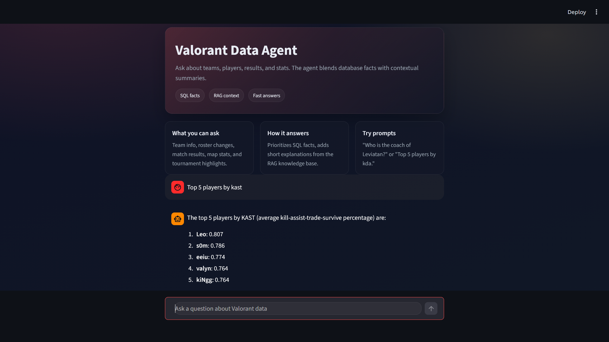
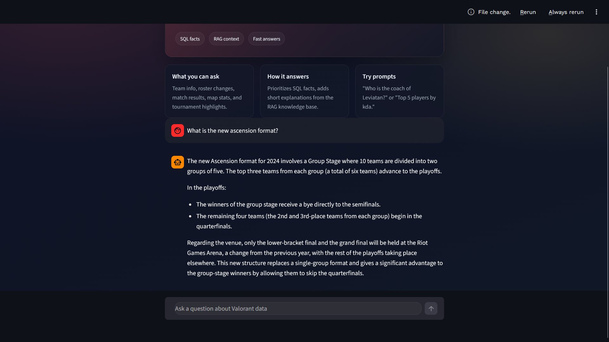

# Valorant Data Agent

A hybrid Q&A agent for Valorant esports data. It combines:
- SQL answers from a local SQLite warehouse (facts and dimensions).
- Retrieval-augmented generation (RAG) over curated articles for context.
- A synthesis step that prioritizes SQL facts and uses RAG for explanations.

## Demo




## How it works
1. **SQL agent** queries `warehouse/vct.sqlite` for factual answers.
2. **RAG chain** retrieves relevant chunks from `app/rag/data/articles.json`.
3. **Final synthesizer** merges both outputs into a single response.

## Project structure (high level)
- `app/` core agent code and Streamlit UI.
- `app/rag/` ingestion and retrieval for the RAG index.
- `data/` data lake zones (raw/clean/gold).
- `dataset/` source CSVs.
- `scripts/` utility scripts to convert/load data.
- `warehouse/` SQLite database built from gold tables.

## Setup
Create a virtual environment and install dependencies:

```bash
python -m venv .venv
.venv\\Scripts\\activate
pip install -U pip
pip install streamlit pandas pyarrow sqlalchemy python-dotenv nltk \
    langchain langchain-core langchain-community langchain-text-splitters \
    langchain-groq langchain-google-genai langchain-huggingface \
    langchain-chroma chromadb sentence-transformers
```

### API keys
The app uses LLM providers. Set one (or both) in a `.env` file at the repo root:

```bash
# For ChatGroq
GROQ_API_KEY=your_key_here

# For ChatGoogleGenerativeAI
GOOGLE_API_KEY=your_key_here
```

## Build the data warehouse
1. **Convert CSVs to Parquet** (raw zone):
   ```bash
   python scripts/convert_to_parquet.py --src dataset --dst data/raw
   ```
2. **Run the notebooks** to produce clean and gold datasets (see `notebooks/`).
3. **Load SQLite** from gold tables:
   ```bash
   python scripts/load_sqlite.py
   ```
   This creates `warehouse/vct.sqlite` and indexes.

## Build the RAG index
This creates a Chroma index from `app/rag/data/articles.json`:

```bash
python app/rag/ingest.py
```

The index is stored under `app/rag/index/chroma`.

## Run the app
Start the Streamlit UI:

```bash
streamlit run app/streamlit_app.py
```

## Programmatic usage
You can also call the agent directly:

```bash
python app/main.py
```

Or import it in Python:

```python
from app.main import answer_question

print(answer_question("Who is the coach of Leviatan?"))
```

## Notes
- The RAG chain downloads NLTK assets on first run (stopwords + punkt).
- The SQL agent expects `warehouse/vct.sqlite` to exist.
- If you only want SQL answers, edit `app/main.py` to skip the RAG step.

## Example questions
- "Who is the coach of Leviatan?"
- "Top 5 players by KDA in 2024"
- "Which teams had the highest win rate on Ascent?"
- "What is the agent pick rate for Jett in VCT 2023?"
